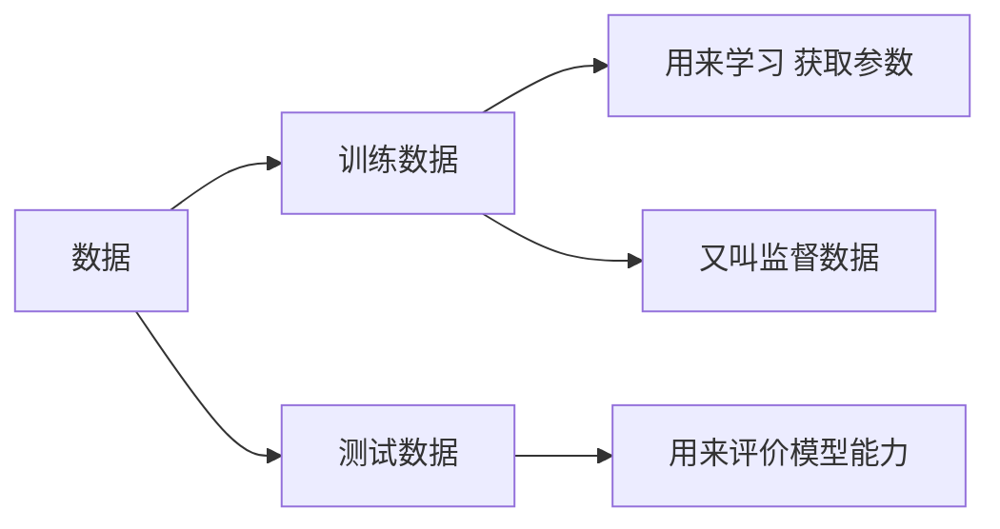

+++
title = "[Datawhale AI 夏令营 深度学习] Task 1 机器学习基础"
date = "2024-08-27"
description = "跟李宏毅学深度学习"
tags = [
 "深度学习",
]
categories = [
 "DataWhale组队学习",
]
image = "https://typora-picturelib.oss-cn-beijing.aliyuncs.com/image-20240827233216175.png"

+++

神经网络产生目的：自动地从数据中学习到合适的权重参数，避免人工设定权重和偏置等参数

神经网络与感知机区别：感知机中神经元之间流动的是0或1的二元信号，而神经网络中流动的是连续的实数值信号

共同点：输出信号的值都在0到1之间


## **激活函数（activation function）**

作用：将输入信号的总和转换为输出信号，连接感知机和神经网络的桥梁


**sigmoid函数**：一种平滑的激活函数


```python
def sigmoid(x):
    return 1 / (1 + np.exp(-x))
```

**阶跃函数**：一旦输入超过阈值，就切换输出的函数


“朴素感知机”是指单层网络，指的是激活函数使用了阶跃函数

“多层感知机”是指神经网络，即使用sigmoid函数等平滑的激活函数的多层网络

无论阶跃还是平滑，两者都属于非线性的函数

激活函数必须使用非线性函数：为了发挥叠加层的优势（多层线性激活函数发挥的功能可以由单层非线性激活函数来代替）

**ReLU函数**


## 多维数组的运算

- **矩阵乘法**


- **神经网络的内积**

在神经网络中，每层间的输入到输出的（前向）处理使用一次矩阵乘法进行，其中需要注意X和W的对应维度的元素个数是否一致

> 神经网络参数形状（以两层手写数字识别网络为例）：
>
> - 输入数据`x`：`[batch_size, 784]`
> - 第一层权重`W1`：`[784, 100]`
> - 第一层偏置`b1`：`[100]`
> - 第一层输出`a1`（激活后）：`[batch_size, 100]`
> - 第二层权重`W2`：`[100, 10]`
> - 第二层偏置`b2`：`[10]`
> - 最终输出`y`（softmax前）：`[batch_size, 10]`

## 神经网络输出层设计

|   问题   |                 问题描述                 | 输出层激活函数 |
| :------: | :--------------------------------------: | :------------: |
| 分类问题 |         数据属于哪一个类别的问题         |  softmax函数   |
| 回归问题 | 根据某个输入预测一个（连续的）数值的问题 |    恒等函数    |

- 恒等函数：将输入按原样输出

- softmax函数：

  - 特点1：输出总和为1（可以把softmax函数的输出解释为“概率”）

  - 特点2：softmax是单调函数，不会改变输出层的数据大小排序，因此只需要对需要输出的（一般是最大的输出结果）使用softmax进行处理即可。因此输出层的softmax函数一般会被省略以减小计算机运算量

  - softmax注意事项：指数函数的值很容易变得非常大，会发生数据溢出（返回值inf）

    解决方法：为所有输入数据减去输入数据的最大值，且这样做不会改变输出结果

  

```python
def softmax(x):
    e_x = np.exp(x - np.max(x))  # 减去最大值以提高数值稳定性
    return e_x / e_x.sum(axis=0)
```

> 神经网络的特征就是可以从数据中学习
>
> “学习”是指从训练数据中自动获取最优权重参数的过程



划分作用：价模型泛化能力——处理未被观察过的数据的能力

## 损失函数

表示神经网络性能的“恶劣程度”的指标。神经网络的最优参数是指损失函数取最小值时的参数

- 均方误差（mean squared error）函数

  $E = \frac{1}{2} \sum_k (y_k - t_k)^2$

​	神经网络的输出和正确解监督数据的各个元素之差的平方，再求总和

```py
def mean_squared_error(y, t):
	return 0.5 * np.sum((y-t)**2)
```

-  交叉熵误差（cross entropy error）函数

  $E = - \sum_k t_k \log y_k%$

交叉熵误差函数实际上只计算对应正确解标签的输出的自然对数

```py
def cross_entropy_error(y, t):
    # 当出现np.log(0)时，np.log(0)会变为负无限大的-inf。添加一个微小值可以防止负无限大的发生
    delta = 1e-7
	return -np.sum(t * np.log(y + delta))
```

## mini-batch学习

从训练数据中选出一批数据(mini-batch)，对每个mini-batch进行学习，求损失函数的和（得到“平均损失函数”）

```python
# 从训练数据中随机抽取10笔数据——使用NumPy的np.random.choice()
train_size = x_train.shape[0]
batch_size = 10
batch_mask = np.random.choice(train_size, batch_size)
x_batch = x_train[batch_mask]
t_batch = t_train[batch_mask]
```

```py
# mini-batch版交叉熵误差的实现
def cross_entropy_error(y, t):
    # one-hot中t为0的元素的交叉熵误差也为0，这些元素的计算可以忽略
    if y.ndim == 1:
        t = t.reshape(1, t.size)
        y = y.reshape(1, y.size)
    batch_size = y.shape[0]
    return -np.sum(t * np.log(y + 1e-7)) / batch_size
```


> 为什么使用损失函数作为评估而非识别精度或准确率：
>
> 识别精度对微小的参数变化基本上没有什么反应，数的微小变化会被阶跃函数抹杀，如果以识别精度为指标，则参数的导数在绝大多数地方都会变为0

## 数值微分

由全部变量的偏导数汇总而成的向量称为梯度

梯度指示的方向是各点处的函数值减小最多的方向

#### 梯度法：寻找函数最小值（或者尽可能小的值）的方法

虽然梯度的方向并不一定指向最小值，但沿着它的方向能够最大限度地减小函数的值。函数的取值从当前位置沿着梯度方向前进一定距离，然后在新的地方重新求梯度，再沿着新梯度方向前进，如此反复，不断地沿梯度方向前进


> 学习率这样的参数称为超参数。和一般的参数不同的是，超参数是人工设定的
>
> 超参数需要尝试多个值，以便找到一种可以使学习顺利进行的设定