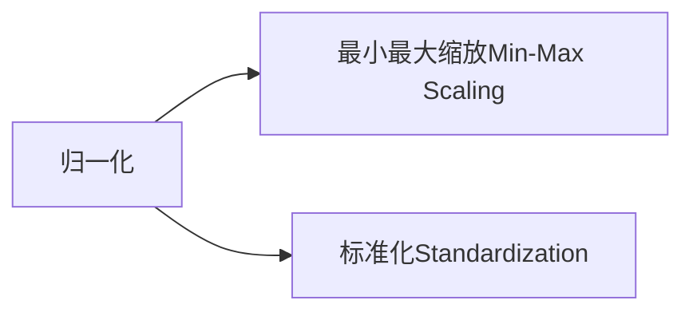

+++

title = "使用神经网络预测二手车价格（三）"

date = "2024-04-27"

description = ""

tags = [

 "",

]

categories = [

 "深度学习",

]

image = "https://typora-picturelib.oss-cn-beijing.aliyuncs.com/image-20240427193007371.png"

+++

# 二手车价格数据分析24-04-27

## 数据重构

对车型编码，品牌、车身类型、燃油类型、变速箱、有尚未修复的损坏、地区编码这几列数据经行on-hot编码处理

对所有因变量使用归一化（StandardScaler）处理



### 归一化的好处

- **统一尺度**：当数据的特征具有不同的单位或量级时，归一化能保证这些特征在模型训练过程中具有相同的重要性。例如，一个特征的范围是 0 到 1000，而另一个特征的范围是 0 到 1，未经缩放直接使用可能会导致模型不公平地偏向于具有更大数值范围的特征。
- **加速学习过程**：许多机器学习算法（如梯度下降）在处理数值范围较小的特征时会表现得更好，因为小的值域可以帮助算法更快地收敛。
- **避免数值计算问题**：在算法中，较大的数值范围可能导致数值计算上的不稳定，例如导致梯度爆炸或消失的问题。

- 如果数据中包含异常值，这种方法可能不是最佳选择，因为异常值会压缩其他所有正常数据的范围到一个很小的区间内。在这种情况下，可能会考虑使用 **标准化**（Standardization），即转换数据使之具有零均值和单位方差。

```py
# 最小最大缩放Min-Max Scaling
data[col] = (data[col]-data[col].min()) / (data[col].max()-data[col].min())
```

```py
df = pd.read_csv(dataset_path + r'/train_clean9.csv')

# one-hot编码
categorical_columns = ['车型编码', '品牌', '车身类型', '燃油类型', '变速箱', '有尚未修复的损坏', '地区编码']
df = pd.get_dummies(df, columns=categorical_columns)

# 取出因变量
X = df.drop('价格', axis=1).values
y = df['价格'].values.reshape(-1, 1)

# 划分数据集
X_train, X_test, y_train, y_test = train_test_split(X, y, test_size=0.2, random_state=42)

# 归一化处理
scaler = StandardScaler()
X_train_scaled = scaler.fit_transform(X_train)
X_test_scaled = scaler.transform(X_test)
```


根据sklearn算法选择路径图，尝试建立基于线性回归的深度学习模型

首先将数据转换成tensor和dl

```py
# 转换为tensor
X_train_tensor = torch.tensor(X_train_scaled, dtype=torch.float32)
y_train_tensor = torch.tensor(y_train.reshape(-1, 1), dtype=torch.float32)
X_test_tensor = torch.tensor(X_test_scaled, dtype=torch.float32)
y_test_tensor = torch.tensor(y_test.reshape(-1, 1), dtype=torch.float32)

# 转换为dl
train_dataset = TensorDataset(X_train_tensor, y_train_tensor)
train_loader = DataLoader(dataset=train_dataset, batch_size=64, shuffle=True)
test_dataset = TensorDataset(X_test_tensor, y_test_tensor)
test_loader = DataLoader(dataset=test_dataset, batch_size=64, shuffle=False)
```

对于X.shape[1]——
```py
dataset_path = r'./Dataset/'
df = pd.read_csv(dataset_path + r'/train_clean9.csv')
categorical_columns = ['车型编码', '品牌', '车身类型', '燃油类型', '变速箱', '有尚未修复的损坏', '地区编码']
df = pd.get_dummies(df, columns=categorical_columns)
X = df.drop('价格', axis=1).values
y = df['价格'].values.reshape(-1, 1)

print(X.shape[1])
```

```py
输出：6631
```

构建模型

```py
class Net(nn.Module):
    def __init__(self):
        super(Net, self).__init__()
        self.layers = nn.Sequential(
            nn.Linear(X.shape[1], 64),
            nn.BatchNorm1d(64),
            nn.ReLU(),

            nn.Linear(64, 128),
            nn.BatchNorm1d(128),
            nn.ReLU(),

            nn.Linear(128, 64),
            nn.BatchNorm1d(64),
            nn.ReLU(),

            nn.Dropout(0.5),
            nn.Linear(64, 1)
        )
```

```py
EPOCHS = 30
BUTCH_SIZE = 256

writer = SummaryWriter('./runs/exp1')
```

使用tensorboard对此网络进行参数变化分析

```py
# 可视化
writer.add_scalar(
    'Loss/train', loss.item(),
    epoch+1
    )

for name, param in self.model.named_parameters():
    writer.add_histogram(name, param, epoch)
    writer.add_histogram(f'{name}.grad', param.grad, epoch)
    
writer.add_scalars(
    'Accuracy', {
    'Train': self.calculate_mse(train_loader),
    'Test': self.calculate_mse(test_loader)
    },epoch+1)

print(f'Epoch [{epoch + 1}/{EPOCHS}], Loss: {loss.item()}')
```


------------------------------------

1. loss对比
    
- 训练数据与测试数据loss相差过大，过拟合

考虑到地区编码占用输入接口过多，选择对其单独重构

分析地区编码与价格间的关系：计算所有不同地区编码对应的全部价格平均值

```py
for df in reader:
    region_price_means = df.groupby('地区编码')['价格'].mean().reset_index()
    output_csv_file = dataset_path + '/region_price_means.csv'
    region_price_means.to_csv(output_csv_file, index=False)
```


发现差异过大，可能数据量较小，收极端值影响大。计算中位数：

```py
for df in reader:
    region_price_means = df.groupby('地区编码')['价格'].median().reset_index()
    output_csv_file = dataset_path + '/region_price_means.csv'
    region_price_means.to_csv(output_csv_file, index=False)
```


编码与价格的关系仍不明显


考虑到两者间确实存在某种关系，将地区编码分组进行比较

```py
for df in reader:
    df['地区编码'] = df['地区编码'].astype(str)
    df['地区编码组'] = df['地区编码'].str[0].astype(int)
    group_price_means = df.groupby('地区编码组')['价格'].median().reset_index()
    group_price_means.to_csv(dataset_path + r'/group_price_median.csv', mode='a', index=False)
```


二者存在相关关系，但不明显，选择将地区编码删去

现在对于X.shape[1]——
```py
print(X.shape[1])
```

```py
输出：321
```

更改神经元数量，替换激活函数

```py
class Net(nn.Module):
    def __init__(self):
        super(Net, self).__init__()
        self.layers = nn.Sequential(
            nn.Linear(X.shape[1], 256),
            nn.BatchNorm1d(256),
            nn.LeakyReLU(),

            nn.Linear(256, 256),
            nn.BatchNorm1d(256),
            nn.LeakyReLU(),

            nn.Linear(256, 128),
            nn.BatchNorm1d(128),
            nn.LeakyReLU(),

            nn.Dropout(0.5),
            nn.Linear(128, 1)
        )
```

```py
EPOCHS = 20
BUTCH_SIZE = 256

writer = SummaryWriter('./runs/exp2')
```

------------------------

1. loss对比


过拟合得到改善，但loss仍然偏高.20epoch时仍有下降趋势，考虑增加epoch数


2. 权值监控|
   

某些神经元权值过大，说明输出值被某一种特征主导，可能是过拟合的标志，且模型的表达性能会受限，考虑重新对数据进行重构


## 测试数据预测

```py
def main():
    model = Net().to(device)
    model.load_state_dict(torch.load(path_load))
    pred = model(X_train_tensor)
    price = pd.DataFrame(pred.detach().cpu().numpy(), columns=['price'])
    res = pd.concat([data.SaleID, price], axis=1)
    res.to_csv(dataset_path + 'output.csv')
```


