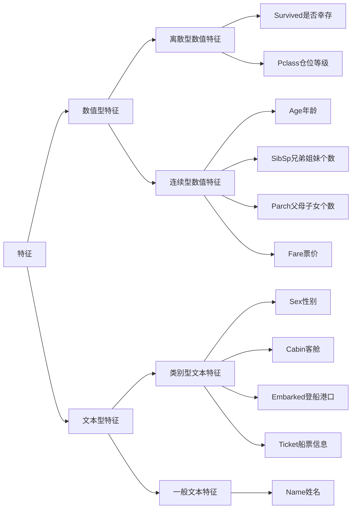
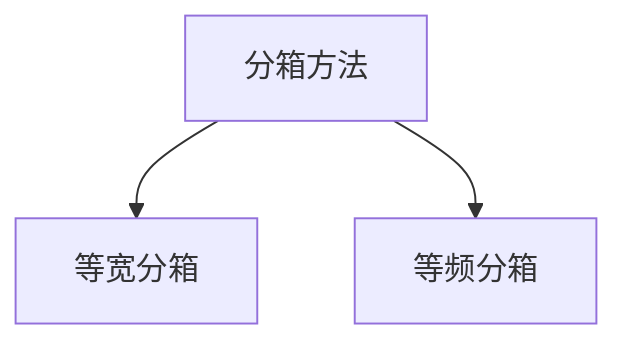

+++
title = "数据分析笔记（四）"

date = "2024-03-25"

description = "4. 特征观察与处理"

tags = [

 "",

]

categories = [

 "数据分析",

]

image = ""

+++

## 特征观察



> 数值型特征一般可以直接用于模型的训练（但有时也会对连续变量进行离散化处理）
>
> 文本型特征往往需要转换成数值型特征才能用于建模分析。

### 离散化处理——数据预处理步骤

**目的**

- **简化分析**：使得数据的分布更容易理解和解释
- **提高数据的稳定性和鲁棒性**：分箱可以减少异常值的影响，提高模型的鲁棒性
- **提高特征的区分度**：提高机器学习模型使用这些特征的区分度

**方法**：分箱操作（也叫离散分箱或分段）——将连续数值分组



等宽分箱：数值范围被等分成具有相同宽度的多个区间

- pd.cut()函数——为输入的df或serie添加指定的新列

  - 例如：

    ```py
    bin_labels = [1,2,3,4,5]
    chunk['年龄层'] = pd.cut(chunk['年龄'], bin=5,labels=bin_labels)
    ```

> 参数
>
> - **x**：需要被分割的一维数组或Series。
> - **bins**
>   - 整数：表示分割成多少个等宽的区间
>   - 序列（如列表或数组）：表示区间的边界
>   - IntervalIndex：表示具体的区间。
> - **right**：布尔值。True表示每个区间包含右端点，False表示不包含。默认为True。
> - **labels**：用于标记返回的分类。可以是布尔值、数组或False。如果为False，则返回整数标签。
> - **retbins**：布尔值。如果为True，则返回区间的边界。
> - **precision**：整数，表示区间边界的小数精度。
> - **include_lowest**：布尔值。如果为True，第一个区间的左端点是闭区间。
> - **duplicates**
>   - =‘raise’:当存在重复的边界时抛出错误
>   - =‘drop’:忽略重复的边界

等频分箱：为每个箱子分配大致相同数量的数据点（按百分比分段）

- pd.qcut()函数

> 参数
>
> - **x**：需要被分割的一维数组或Series
> - **q**：整数或分位数数组
>   - 如果为整数：将数据分割成多少个等频区间
>   - 如果为分位数数组（如[0, .25, .5, .75, 1]）：表示具体的分位数边界
> - **labels**、**retbins**、**precision**、**duplicates**与`cut()`函数中相同

### 对文本变量进行转换

1. 查看类别文本变量名及种类

   - value_counts

   - unique():
     - 例如：`df['Sex'].unique()` –>`array(['male', 'female', 0], dtype=object)`

2. 特征类型转换

   - 转换为数值

     - replace

       ```py
       df['Sex_num'] = df['Sex'].replace(['male','female'],[1,2])
       ```

     - 使用sklearn.preprocessing的LabelEncoder

   - 转换为one-hot编码

     - get_dummies()函数

       ```py
       pd.get_dummies(data, prefix=None, prefix_sep='_', dummy_na=False, columns=None, sparse=False, drop_first=False, dtype=None)
       ```

       > 参数
       >
       > - **data**：输入的数据——DataFrame（通常是df的某一列）或Series。
       > - **prefix**：给列名添加前缀，以区分不同的分类变量的独热编码列。
       > - **prefix_sep**：前缀和列名之间的分隔符，默认为`'_'`。
       > - **dummy_na**：布尔值，是否为缺失值（NaN）添加一列，表示缺失，默认为False。
       > - **columns**：列表，指定需要进行独热编码的列名。如果为None，则对所有对象类型和分类类型的列进行编码。
       > - **sparse**：布尔值，是否将得到的哑变量列转换为稀疏格式，默认为False。
       > - **drop_first**：布尔值，是否删除第一个等级的列，默认为False。
       >   - 减少一个等级的列的目的是避免多重共线性
       >   - 虽然减少了一个等级的列，但这个类别可以由其他类别的0值推断出来
       > - **dtype**：指定编码列的数据类型。

       ​	get_dummies()会返回一个由列生成的df数据，我们需要将这个数据与原本的df合并，这时需要使用concat方法将多个`DataFrame`或`Series`对象合并成一个`DataFrame`

       ```py
       x = pd.get_dummies(df[Age], prefix="Age")
       df = pd.concat([df, x], axis=1)
       ```

3. 从纯文本Name特征里提取出Titles的特征(所谓的Titles就是Mr,Miss,Mrs等)
   - 使用series.str.extract()字符串提取函数和正则表达式